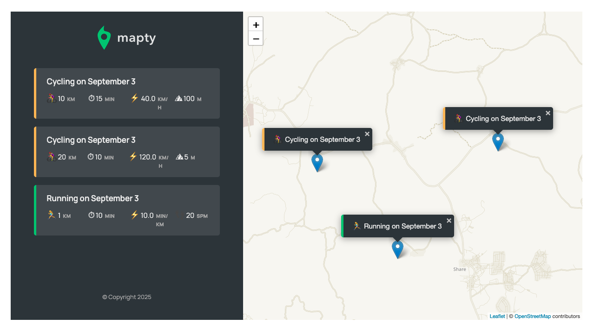

# Mapty

Mapty is a web application that allows users to map and track their running and cycling workouts. It uses Leaflet.js for interactive mapping and localStorage for data persistence.

## Features
- Log running and cycling workouts by clicking on the map
- View workout details (distance, duration, pace/speed, cadence/elevation)
- Persistent storage of workouts in browser localStorage
- Responsive sidebar for workout history
- Interactive map powered by Leaflet.js

## Showcase

## Architecture

## Flowchart

## Getting Started
1. Clone or download this repository.
2. Open `index.html` in your browser.
3. Allow location access to use the mapping features.

## File Structure
- `index.html`: Main HTML file
- `script.js`: Application logic
- `style.css`: Styling
- `img/`: Images and icons

## Technologies Used
- JavaScript (ES6+)
- Leaflet.js
- HTML5 & CSS3

